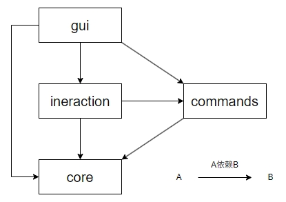
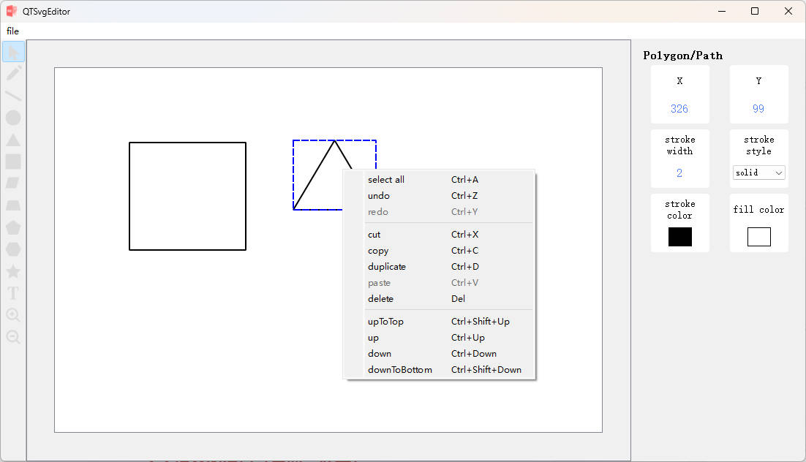

# 一、模块概览

本工程分为四大核心库（libs）：

1. **core** 静态库

   * 提供 SVG 文档模型、元素定义、解析与写入功能。
   * 主要负责 `SvgDocument`, `SvgElement` 及其子类（`SvgRect`、`SvgEllipse`、`SvgLine`、`SvgPolygon`、`SvgFreehand`、`SvgText`）的管理。
   * 提供异常类型 `SvgException`。

2. **commands** 动态库

   * 封装所有可撤销/重做的编辑操作，每个命令继承自 `QUndoCommand`。
   * 包含 `AddElementsCommand`, `DeleteElementsCommand`, `MoveElementsCommand`, `ResizeElementCommand`, `ChangeAttributeCommand`, `OrderCommand`等命令。
   * 提供 `CommandManager` 单例，管理内部的 `QUndoStack`。

3. **interaction** 静态库

   * 负责左侧工具栏到模型操作的映射。
   * 包含抽象类 `ToolController` 及其子类：`MoveToolController`, `RectToolController`, `EllipseToolController`, `LineToolController`, `PolygonToolController`, `FreehandToolController`, `TextToolController`, `ZoomToolController`。
   * `CanvasController`：中央控制器，管理所有工具控制类，接收来自 `CanvasView` 的事件并分发给当前工具。
   * `SelectionManager` 单例，管理当前选中元素列表。

4. **gui** 静态库

   * 提供界面组件及布局：`MainWindow`, `SideToolBar`,`MenuBar`,`CanvasView`, `GraphicsSvgItem`,`Clipboard`, 各类属性面板 (`PropertyPanelFactory`,`PropertyPanel`, `RectPropertyPanel` 等), `LayerPanel`, `PreviewPanel`, `DockManager`。
   * 负责视图渲染、用户交互界面、信号与槽连接。

### 模块之间依赖关系



* **gui** 依赖于 **interaction**（连接 CanvasView 与工具控制器）、 **core**（渲染 `SvgElement`） 和 **commands**（执行复制、图层管理等命令）。
* **interaction** 依赖于 **core**（创建模型）及 **commands**（执行命令）。
* **commands** 依赖于 **core**（编辑模型）。

# 二、MVC 三层架构

本编辑器采用典型的 MVC（三层）架构，将系统分为：

* **Model（模型层，对应 core）**
  负责管理 SVG 文档结构与数据，包括 `SvgDocument` 及所有 `SvgElement` 子类。它提供属性存取、序列化、解析、异常处理等功能，并通过信号（如 `documentChanged`、`attributeChanged`）通知视图层。

* **View（视图层，对应 gui）**
  负责界面渲染与用户可视化展示，包括主窗口 (`MainWindow`)、工具栏 (`SideToolBar`)、菜单栏（`MenuBar`）、画布视图 (`CanvasView`)、图形项 (`GraphicsSvgItem`)、属性面板等。视图层监听 Model 的信号，按照最新数据更新画面，并捕获用户的图形界面交互。

* **Controller（控制层，对应 interaction）**
  负责将 View 捕获的用户输入事件（鼠标、键盘）转换为对 Model 的操作。包括 `CanvasController` 分发事件给具体的 `ToolController`（如具体图形的绘制、移动、缩放工具），以及在必要时通过 `CommandManager` 执行可撤销/重做的命令。

这样，三层职责清晰分离：

1. **Model** 专注图形数据管理；
2. **View** 专注界面渲染；
3. **Controller** 专注用户交互与流程控制。

# 三、设计模式
1. **单例模式**

   * **CommandManager**：封装 `QUndoStack`，全局唯一，用于执行、撤销、重做命令。
   * **SelectionManager**：管理当前选中 `SvgElement` 列表，发射 `selectionChanged` 信号。
   * **Clipboard**：管理复制/剪切缓存。

2. **简单工厂模式**

   * **PropertyPanel**：根据 `SelectionManager` 中的`SvgElement`数量和类型动态创建对应的属性面板（`RectanglePropertyPanel`、`EllipsePropertyPanel`、`TextPropertyPanel` 等），解耦面板生成逻辑。

3. **观察者模式**

   * **`SvgDocument`** 作为主题，内部在结构或内容变化时发射 `documentChanged`等信号，**`CanvasView`** 监听并更新场景。
   * **`SvgElement`** 每当属性改变时发射 `attributeChanged(name, value)` 信号，**`GraphicsSvgItem`** 监听并实时更新渲染。

# 四、核心类设计与继承关系

```txt
SvgElement (abstract)
├─ SvgRect
├─ SvgEllipse
├─ SvgLine
├─ SvgPolygon
├─ SvgFreehand
├─ SvgStar
└─ SvgText
```

* **`SvgElement`** 继承自 `QObject` (`Q_OBJECT`), 提供属性管理、序列化接口(`toXml`, `fromXml`)，并发射属性变化信号。

```txt
QUndoCommand
├─ Command (abstract wrapper)
   ├─ AddElementCommand
   ├─ RemoveElementCommand
   ├─ MoveElementCommand
   ├─ ResizeElementCommand
   ├─ RotateElementCommand
   ├─ ChangeAttributeCommand
   ├─ InsertTextCommand
   └─ DeleteElementCommand
```

* **`Command`** (可选抽象)或各命令直接继承自 `QUndoCommand`，实现 `redo()`/`undo()`。

```txt
QObject
└─ ToolController (abstract)
   ├─ MoveToolController
   ├─ RectToolController
   ├─ EllipseToolController
   ├─ LineToolController
   ├─ PolygonToolController
   ├─ FreehandToolController
   ├─ StarToolController
   ├─ TextToolController
   └─ ZoomToolController
```

* **`ToolController`** 继承自 `QObject`，定义虚接口 `onMousePress/Move/Release`, `onKeyPress`。
* **`CanvasController`** 监听 `SideToolBar::toolSelected`，切换当前 `ToolController` 并分发事件。

```txt
QWidget
└─ PropertyPanel (abstract)
   ├─ RecPropertyPanel
   ├─ EllipsePropertyPanel
   ├─ LinePropertyPanel
   ├─ PathPropertyPanel
   ├─ TextPropertyPanel
   └─ ...
```

* **`PropertyPanel`** 继承 `QWidget`，依赖于 `PropertyPanelFactory` 动态创建和展示，提供 `setElement(elem)`。

# 五、异常处理

* **`SvgException`**

  * 继承自 `std::exception` 或 `QException`，用于 XML 解析、文件 IO 错误。
  * 在 `SvgParser`, `SvgWriter`中抛出并在顶层捕获，弹出错误对话框。

# 六、功能设计
*  所有基础功能均已实现
*  进阶功能中除了多文件管理都已实现
*  另外还实现了国际化，支持中英两种语言
   

# 七、优点与缺点
### 优点
1. **职责分离**：Model、View、Controller 各司其职，降低模块耦合度，便于团队协作与模块化开发。
2. **可维护性高**：修改某一层的实现（如 UI 样式）不会影响其他层，降低了回归风险。
3. **可扩展性强**：新增工具或面板，只需在相应层添加，遵循接口即可，无需改动核心逻辑。
4. **可测试性好**：业务逻辑（Model）和交互控制（Controller）可在无 UI 环境下独立单元测试。

### 缺点

1. **初期开发成本高**：三层架构需先搭建各层接口与通信机制，前期设计复杂度较高。
2. **性能开销**：信号槽和多次层间调用可能带来一定运行时开销，对超高性能场景不友好。
3. **内存占用大**：MVC 模式下，gui层和core层分别维护了一个对应图形的类，造成了额外的内存开销。
4. **调试复杂度**：事件和信号跨层流转，调试时需要跟踪调用链，多层堆栈可能增加定位难度。